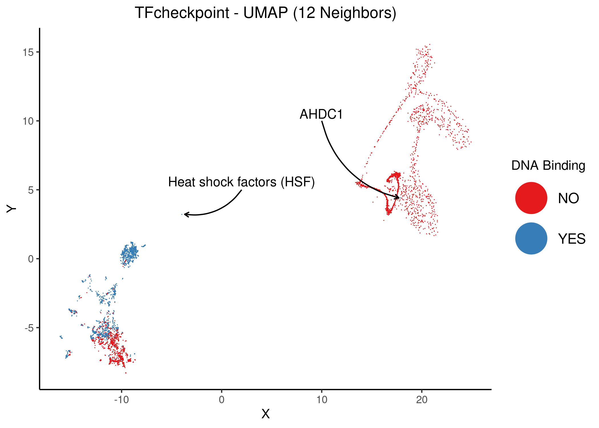

# Input {-}

Loading libraries:

```r
library(xfun)
```

# Intro {-}

TFcheckpoint [@Chawla2013] is a curated database with sequence-specific DNA-binding RNA polymerase II transcription-factor proteins (**DbTFs**).

The form of the dataset is as follows: a total of $4705$ proteins, each one represented by a row, are enriched with GO annotations (a total of $8621$ GO terms [@Carbon2019]) that indicate the presence ($1$) or absence ($0$) of a particular molecular function. 
The dataset is provided as a [tab-delimited file](https://github.com/druglogics/tfcheckpoint-umap/blob/main/data/genes2go_result_tfcheckpoint2_data.txt).

In this analysis we present a 2D visualization of this dataset using the non-linear dimension reduction method UMAP [@McInnes2018a].
This method will reduce the size of the dataset from $(4705 \times 8621)$ to $(4705 \times 2)$ while efficiently identifying groups of proteins with the same molecular characterization. 
These groups are indicated by varying size clusters in the 2D plane.

# Analysis {-}

:::{.blue-box}
See script [umap.R](https://github.com/druglogics/tfcheckpoint-umap/blob/main/scripts/umap.R) for more details about the presented analysis.
:::

## Tuning the number of neighbors {-}

We first run the UMAP on the dataset in unsupervised mode to see how well it clusters the GO-enriched protein data.
We used the default *euclidean* distance metric to find nearest neighbors for every data point (GO-annotated protein).
We first tune one of the most important parameters, i.e. the **number of neighbors**, where larger values result in more *global* views of the dataset, while smaller values result in more *local* data being preserved.
After UMAP returns the 2D optimized coordinates for the proteins, we color each protein according to its corresponding value for the *DNA binding* GO term, in order to assess if UMAP can at least distinguish between DNA binding (DbTFs) and non DNA-binding TFs (non-DbTFs).


```r
knitr::include_graphics(path = 'img/tf_umap_2n.png')
knitr::include_graphics(path = 'img/tf_umap_4n.png')
```

<div class="figure">

<p class="caption">(\#fig:umap-neigh-1)Unsupervised UMAP of the TFcheckpoint dataset using 2 and 4 neighbors. DbTFs are colored atop the 2D embedding.</p>
</div>


```r
knitr::include_graphics(path = 'img/tf_umap_6n.png')
knitr::include_graphics(path = 'img/tf_umap_8n.png')
```

<div class="figure">

<p class="caption">(\#fig:umap-neigh-2)Unsupervised UMAP of the TFcheckpoint dataset using 6 and 8 neighbors. DbTFs are colored atop the 2D embedding.</p>
</div>


```r
knitr::include_graphics(path = 'img/tf_umap_10n.png')
knitr::include_graphics(path = 'img/tf_umap_12n.png')
```

<div class="figure">

<p class="caption">(\#fig:umap-neigh-3)Unsupervised UMAP of the TFcheckpoint dataset using 10 and 12 neighbors. DbTFs proteins are colored atop the 2D embedding.</p>
</div>


```r
knitr::include_graphics(path = 'img/tf_umap_14n.png')
knitr::include_graphics(path = 'img/tf_umap_15n.png')
```

<div class="figure">

<p class="caption">(\#fig:umap-neigh-4)Unsupervised UMAP of the TFcheckpoint dataset using 14 and 15 neighbors. DbTFs are colored atop the 2D embedding.</p>
</div>


```r
knitr::include_graphics(path = 'img/tf_umap_17n.png')
knitr::include_graphics(path = 'img/tf_umap_20n.png')
```

<div class="figure">

<p class="caption">(\#fig:umap-neigh-5)Unsupervised UMAP of the TFcheckpoint dataset using 17 and 20 neighbors. DbTFs are colored atop the 2D embedding.</p>
</div>

Lastly, using as basis the embedding with $12$ neighbors, we annotate two cases of DbTFs that stand out from the clustered data:

```r
knitr::include_graphics(path = 'img/tf_umap_12n_annot.png')
```

<div class="figure">

<p class="caption">(\#fig:umap-neigh-annot)Unsupervised UMAP of the TFcheckpoint dataset using 12 neighbors. DbTFs proteins are colored atop the 2D embedding. Two distinct examples of DbTFs have been annotated: the AHDC1 and the Heat shock factor proteins.</p>
</div>

:::{.green-box}
For $\ge 8-10$ neighbors, UMAP splits the dataset to $3$ distinct TF protein superclusters:

1. One of superclusters has strictly non-DbTFs and can be practically identified by one of the **reduced dimensions** (it does not matter which one you choose when observing more global views of the dataset, i.e. with larger number of neighbors, the following is enough: $X>0 \text{ or } Y<0$).
Interestingly, there is only one protein that is a DbTF and resides within this cluster as shown above and that protein is [AHDC1](https://en.wikipedia.org/wiki/AHDC1).
2. One supercluster has **mostly DbTFs**.
A set of them is somewhat apart from the parent supercluster, namely the [heat shock factor proteins](https://en.wikipedia.org/wiki/Heat_shock_factor).
The complete list includes these proteins: `HSF1`, `HSF2`, `HSF4`, `HSF5`, `HSFX1`, `HSFY1`, `HSFY2`, `HSFX2`, `HSFX3`, `HSFX4` (their $(X,Y)$ coordinates are really close and are thus presented as one point in the map).
3. One supercluster has **a mix of both DbTFs and non-DbTFs**.
Since this cluster is closer to the second one, it point to us the fact that the included non-DbTFs have molecular functions that are more similar to DbTFs compared with the far off first supercluster that includes the *pure* (so-to-speak) DbTFs.
:::

## Tuning minimum distance {-}

Choosing $15$ as a base value for the number of neighbors, we will tune the `min_dist` UMAP parameter which is the effective minimum distance between the embedded points (the default value presented in the previous figures was $0.01$).
As the documentation says, smaller `min_dist` values will result in a more clustered/clumped embedding where nearby points on the manifold are drawn closer together, while larger values will result on a more even dispersal of points.
The idea here is to keep the separation of the $3$ superclusters as much as possible, while *spreading out* the embedded points.


```r
knitr::include_graphics(path = 'img/tf_umap_15n_mindist_0.05.png')
knitr::include_graphics(path = 'img/tf_umap_15n_mindist_0.1.png')
```

<div class="figure">

<p class="caption">(\#fig:umap-min-dist-1)Unsupervised UMAP of the TFcheckpoint dataset using 15 neighbors and different values of the `mind_dist` parameter. DbTFs are colored atop the 2D embedding.</p>
</div>


```r
knitr::include_graphics(path = 'img/tf_umap_15n_mindist_0.3.png')
knitr::include_graphics(path = 'img/tf_umap_15n_mindist_0.5.png')
```

<div class="figure">

<p class="caption">(\#fig:umap-min-dist-2)Unsupervised UMAP of the TFcheckpoint dataset using 15 neighbors and different values of the `mind_dist` parameter. DbTFs are colored atop the 2D embedding.</p>
</div>


```r
knitr::include_graphics(path = 'img/tf_umap_15n_mindist_0.7.png')
knitr::include_graphics(path = 'img/tf_umap_15n_mindist_1.png')
```

<div class="figure">

<p class="caption">(\#fig:umap-min-dist-3)Unsupervised UMAP of the TFcheckpoint dataset using 15 neighbors and different values of the `mind_dist` parameter. DbTFs are colored atop the 2D embedding.</p>
</div>

:::{.green-box}
For `min_dist` $\gt 0.1$, the separation of the superclusters (specifically for the $2$ top-left ones) dissolves.
:::

# R session info {-}


```{.r .fold-show}
xfun::session_info()
```

```
R version 3.6.3 (2020-02-29)
Platform: x86_64-pc-linux-gnu (64-bit)
Running under: Ubuntu 20.04.1 LTS

Locale:
  LC_CTYPE=en_US.UTF-8       LC_NUMERIC=C              
  LC_TIME=en_US.UTF-8        LC_COLLATE=en_US.UTF-8    
  LC_MONETARY=en_US.UTF-8    LC_MESSAGES=en_US.UTF-8   
  LC_PAPER=en_US.UTF-8       LC_NAME=C                 
  LC_ADDRESS=C               LC_TELEPHONE=C            
  LC_MEASUREMENT=en_US.UTF-8 LC_IDENTIFICATION=C       

Package version:
  base64enc_0.1.3 bookdown_0.21   compiler_3.6.3  digest_0.6.27  
  evaluate_0.14   glue_1.4.2      graphics_3.6.3  grDevices_3.6.3
  highr_0.8       htmltools_0.5.0 jsonlite_1.7.1  knitr_1.30     
  magrittr_1.5    markdown_1.1    methods_3.6.3   mime_0.9       
  png_0.1-7       rlang_0.4.8     rmarkdown_2.5   stats_3.6.3    
  stringi_1.5.3   stringr_1.4.0   tinytex_0.26    tools_3.6.3    
  utils_3.6.3     xfun_0.18       yaml_2.2.1     
```

# References {-}
