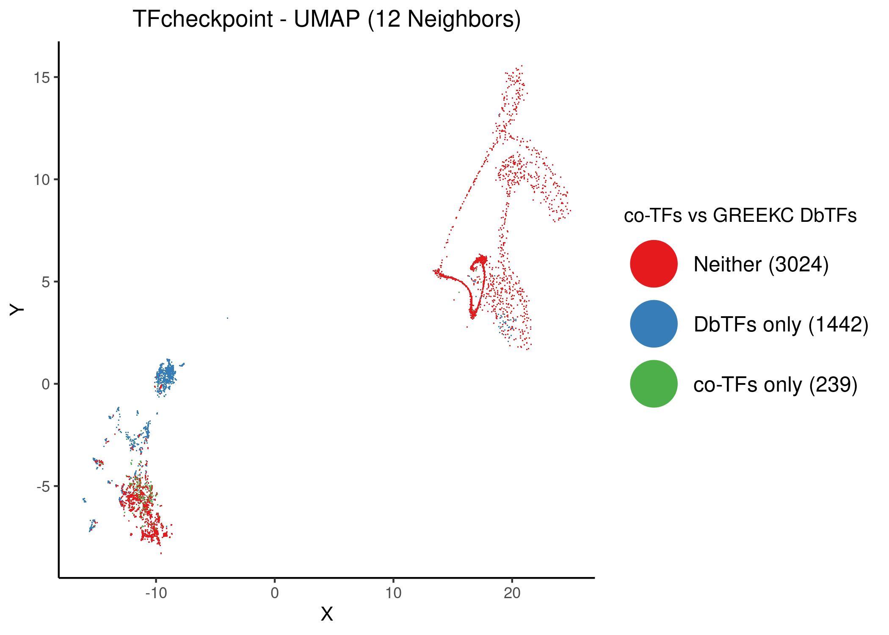
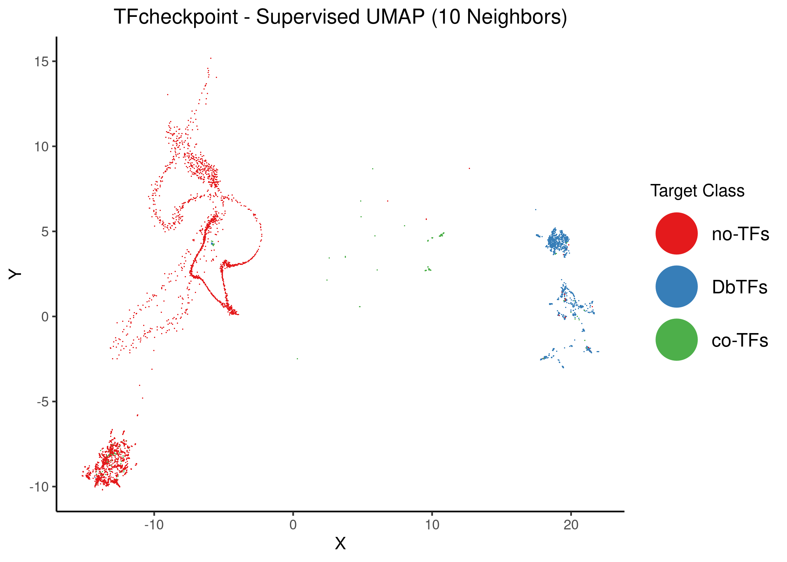
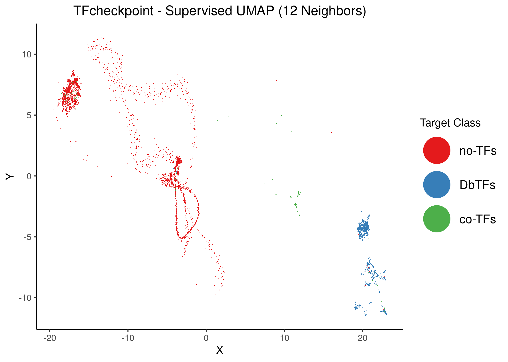
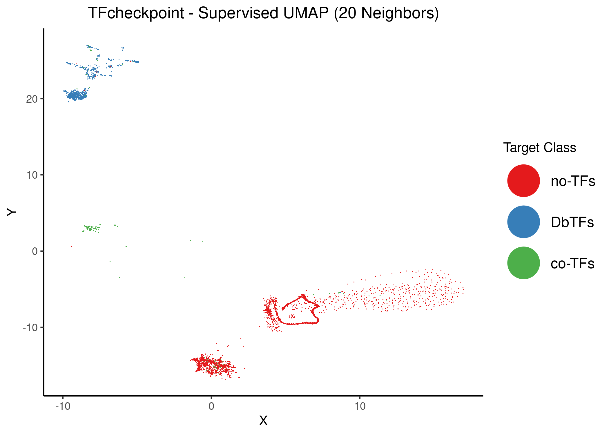
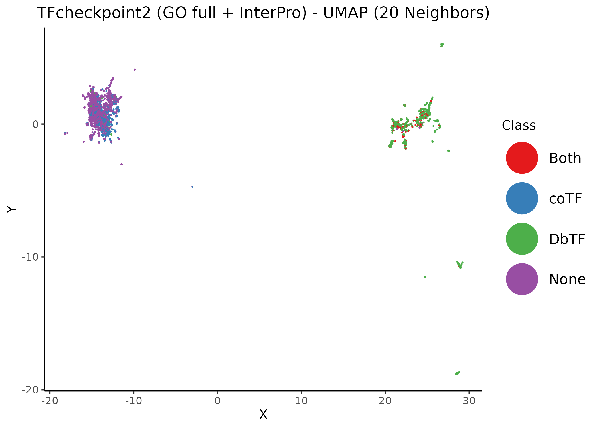

# Input {-}

Loading libraries:

```r
library(xfun)
library(dplyr)
library(scales)
```

# Intro {-}

TFcheckpoint [@Chawla2013] is a curated database with sequence-specific DNA-binding RNA polymerase II transcription-factor proteins (**DbTFs**).
It has been updated to include several co-TFs and other unclassified proteins since the first publication.

## Old Dataset {-}

The form of the dataset is as follows: a total of $4705$ proteins, each one represented by a row, are enriched with GO annotations (a total of $8621$ GO terms [@Carbon2019]) that indicate the presence ($1$) or absence ($0$) of a particular molecular function. 
The dataset is provided as a [tab-delimited file](https://github.com/druglogics/tfcheckpoint-umap/blob/main/data/genes2go_result_tfcheckpoint2_data.tsv).

:::{.green-box}
Analysis on this dataset was performed **November 2020**.
:::

## New Dataset {-}

The new dataset features an updated curated list of $3875$ proteins that are part of TFcheckpoint (v2).
For each of these proteins, we have gathered **Gene ontology (GO) IDs** and cross-referenced **InterPro domains**, using UniProt's ID mapping [online service](https://www.uniprot.org/uploadlists/) (`UniProtKB` for `To` mapping option and selecting the appropriate columns).
The resulting data file is available as a [tab-delimited file](https://github.com/druglogics/tfcheckpoint-umap/blob/main/data/tfc2_all_human_go_interpro_22102021_ALL.tsv) (retrieved 22/10/2021).

:::{.green-box}
Analysis on this dataset was performed **June-November 2021** (sporadically :) and will be featured in the second TF-checkpoint paper.
:::

## On UMAP {-}

In this analysis we present a 2D visualization of the TF-checkpoint dataset using the non-linear dimension reduction method UMAP [@McInnes2018a].
This method will reduce for example the size of the **old dataset** from $(4705 \times 8621)$ to $(4705 \times 2)$ while efficiently identifying groups of proteins with the same molecular characterization.
These groups are indicated by varying size clusters in the 2D plane.

# Analysis (Old Dataset) {-}

:::{.blue-box}
See script [umap.R](https://github.com/druglogics/tfcheckpoint-umap/blob/main/scripts/umap.R) for more details about the presented analysis.
:::

## Tuning the number of neighbors {-}

We first run the UMAP on the dataset in unsupervised mode to see how well it clusters the GO-enriched protein data.
We used the default *euclidean* distance metric to find nearest neighbors for every data point (GO-annotated protein).
We first tune one of the most important parameters, i.e. the **number of neighbors**, where larger values result in more *global* views of the dataset, while smaller values result in more *local* data being preserved.
After UMAP returns the 2D optimized coordinates for the proteins, we color each protein according to its corresponding value for the *DNA binding* GO term, in order to assess if UMAP can at least distinguish between DNA binding (DbTFs) and non DNA-binding TFs (non-DbTFs).


```r
knitr::include_graphics(path = 'img/tf_umap_2n.png')
knitr::include_graphics(path = 'img/tf_umap_4n.png')
```

<div class="figure">

<p class="caption">(\#fig:umap-neigh-1)Unsupervised UMAP of the TFcheckpoint dataset using 2 and 4 neighbors. DbTFs are colored atop the 2D embedding.</p>
</div>


```r
knitr::include_graphics(path = 'img/tf_umap_6n.png')
knitr::include_graphics(path = 'img/tf_umap_8n.png')
```

<div class="figure">

<p class="caption">(\#fig:umap-neigh-2)Unsupervised UMAP of the TFcheckpoint dataset using 6 and 8 neighbors. DbTFs are colored atop the 2D embedding.</p>
</div>


```r
knitr::include_graphics(path = 'img/tf_umap_10n.png')
knitr::include_graphics(path = 'img/tf_umap_12n.png')
```

<div class="figure">

<p class="caption">(\#fig:umap-neigh-3)Unsupervised UMAP of the TFcheckpoint dataset using 10 and 12 neighbors. DbTFs proteins are colored atop the 2D embedding.</p>
</div>


```r
knitr::include_graphics(path = 'img/tf_umap_14n.png')
knitr::include_graphics(path = 'img/tf_umap_15n.png')
```

<div class="figure">

<p class="caption">(\#fig:umap-neigh-4)Unsupervised UMAP of the TFcheckpoint dataset using 14 and 15 neighbors. DbTFs are colored atop the 2D embedding.</p>
</div>


```r
knitr::include_graphics(path = 'img/tf_umap_17n.png')
knitr::include_graphics(path = 'img/tf_umap_20n.png')
```

<div class="figure">

<p class="caption">(\#fig:umap-neigh-5)Unsupervised UMAP of the TFcheckpoint dataset using 17 and 20 neighbors. DbTFs are colored atop the 2D embedding.</p>
</div>

Lastly, using as basis the embedding with $12$ neighbors, we annotate two cases of DbTFs that stand out from the clustered data:

```r
knitr::include_graphics(path = 'img/12n_extra/tf_umap_12n_annot.png')
```

<div class="figure">

<p class="caption">(\#fig:umap-neigh-annot)Unsupervised UMAP of the TFcheckpoint dataset using 12 neighbors. DbTFs proteins are colored atop the 2D embedding. Two distinct examples of DbTFs have been annotated: the AHDC1 and the Heat shock factor proteins.</p>
</div>

:::{.green-box}
For $\ge 8-10$ neighbors, UMAP splits the dataset to $3$ distinct TF protein superclusters:

1. One of superclusters has strictly non-DbTFs and can be practically identified by one of the **reduced dimensions** (it does not matter which one you choose when observing more global views of the dataset, i.e. with larger number of neighbors, the following is enough: $X>0 \text{ or } Y<0$).
Interestingly, there is only one protein that is a DbTF and resides within this cluster as shown above and that protein is [AHDC1](https://en.wikipedia.org/wiki/AHDC1).
2. One supercluster has **mostly DbTFs**.
A set of them is somewhat apart from the parent supercluster, namely the [heat shock factor proteins](https://en.wikipedia.org/wiki/Heat_shock_factor).
The complete list includes these proteins: `HSF1`, `HSF2`, `HSF4`, `HSF5`, `HSFX1`, `HSFY1`, `HSFY2`, `HSFX2`, `HSFX3`, `HSFX4` (their $(X,Y)$ coordinates are really close and are thus presented as one point in the map).
3. One supercluster has **a mix of both DbTFs and non-DbTFs**.
Since this cluster is closer to the second one, it point to us the fact that the included non-DbTFs have molecular functions that are more similar to DbTFs compared with the far off first supercluster that includes the *pure* (so-to-speak) DbTFs.
:::

## GREEKC curated DbTF list {-}

Members of the [GREEKC](https://www.greekc.org/) consortium curated a list of DbTFs.
Comparing this list with the proteins that have the GO term `DNA binding` in the TF checkpoint dataset we have the following contingency table ($1$ corresponds to a DbTF label, $0$ to a non-DbTF label):

```r
dbtf_stats = readRDS(file = 'data/dbtfs_go_greekc_stats.rds')
knitr::kable(dbtf_stats)
```


|GO-DbTF |GREEKC-DbTF |    n|
|:-------|:-----------|----:|
|0       |0           | 2751|
|1       |0           |  512|
|0       |1           |   86|
|1       |1           | 1356|

We calculate the percent agreement and Cohen's $\kappa$:

```r
n_total = dbtf_stats$n %>% sum()
data_00 = dbtf_stats %>% filter(`GO-DbTF` == 0, `GREEKC-DbTF` == 0) %>% pull(n)
data_10 = dbtf_stats %>% filter(`GO-DbTF` == 1, `GREEKC-DbTF` == 0) %>% pull(n)
data_01 = dbtf_stats %>% filter(`GO-DbTF` == 0, `GREEKC-DbTF` == 1) %>% pull(n)
data_11 = dbtf_stats %>% filter(`GO-DbTF` == 1, `GREEKC-DbTF` == 1) %>% pull(n)

# calculate percent agreement
percent = (data_00 + data_11)/n_total
scales::percent(percent)
```

```
[1] "87%"
```

```r
# Cohen's kappa
p0 = (data_00 + data_01)/n_total * (data_00 + data_10)/n_total
p1 = (data_11 + data_01)/n_total * (data_11 + data_10)/n_total
p_rand = p0 + p1
cohen_k = (percent - p_rand)/(1 - p_rand)
scales::percent(cohen_k)
```

```
[1] "72%"
```

:::{.green-box}
There is a **substantial level of agreement** between the GO DNA-binding annotation and the DbTF GREEKC list.
:::

Using the UMAP coordinates with $12$ neighbors, we color the data points according to the GREEKC annotated DbTFs labels and *boxify* the corresponding superclusters:

```r
knitr::include_graphics(path = 'img/12n_extra/tf_umap_12n_greekc_dbtfs.png')
```

<div class="figure">

<p class="caption">(\#fig:umap-12n-greekc-dbtfs)Unsupervised UMAP of the TFcheckpoint dataset using 12 neighbors. DbTFs proteins according to the curated GREEKC list are colored atop the 2D embedding. The three protein superclusters have been given corresponding ids.</p>
</div>

:::{.blue-box}
For more info, see the [data file](https://github.com/druglogics/tfcheckpoint-umap/tree/main/data/12n_dbtf_cluster_annot.tsv) with the protein names, the cluster id, the GREEKC DbTF and the GO term DNA binding annotation.
:::

We also color the same points according to the values presented in the contingency table above (including thus all $4$ cases of proteins as annotated by the GREEKC and the DNA-binding GO term):

```r
knitr::include_graphics(path = 'img/12n_extra/tf_umap_12n_go_vs_greekc_dbtfs.png')
```

<div class="figure">

<p class="caption">(\#fig:umap-12n-go-vs-greekc-dbtfs)Unsupervised UMAP of the TFcheckpoint dataset using 12 neighbors. Proteins are pre-assigned to 4 groups depending on the value of the corresponding DNA-binding GO term and if are in the curated GREEKC list of DbTFs.</p>
</div>

:::{.green-box}
- There are a lot more DbTFs now residing inside the non-DbTF supercluster (No. $3$)
- The No. $1$ supercluster with no DbTFs has become a bit more distinguished, i.e. almost all it's points are non-DbTFs according to the GREEKC list information.
- Maybe the curated list better reflects the clustered data than the DNA-binding GO term thus?
:::

## Tuning minimum distance {-}

Choosing $15$ as a base value for the number of neighbors, we will tune the `min_dist` UMAP parameter which is the effective minimum distance between the embedded points (the default value presented in the previous figures was $0.01$).
As the documentation says, smaller `min_dist` values will result in a more clustered/clumped embedding where nearby points on the manifold are drawn closer together, while larger values will result on a more even dispersal of points.
The idea here is to keep the separation of the $3$ superclusters as much as possible, while *spreading out* the embedded points.


```r
knitr::include_graphics(path = 'img/tf_umap_15n_mindist_0.05.png')
knitr::include_graphics(path = 'img/tf_umap_15n_mindist_0.1.png')
```

<div class="figure">

<p class="caption">(\#fig:umap-min-dist-1)Unsupervised UMAP of the TFcheckpoint dataset using 15 neighbors and different values of the `mind_dist` parameter. DbTFs are colored atop the 2D embedding.</p>
</div>


```r
knitr::include_graphics(path = 'img/tf_umap_15n_mindist_0.3.png')
knitr::include_graphics(path = 'img/tf_umap_15n_mindist_0.5.png')
```

<div class="figure">

<p class="caption">(\#fig:umap-min-dist-2)Unsupervised UMAP of the TFcheckpoint dataset using 15 neighbors and different values of the `mind_dist` parameter. DbTFs are colored atop the 2D embedding.</p>
</div>


```r
knitr::include_graphics(path = 'img/tf_umap_15n_mindist_0.7.png')
knitr::include_graphics(path = 'img/tf_umap_15n_mindist_1.png')
```

<div class="figure">

<p class="caption">(\#fig:umap-min-dist-3)Unsupervised UMAP of the TFcheckpoint dataset using 15 neighbors and different values of the `mind_dist` parameter. DbTFs are colored atop the 2D embedding.</p>
</div>

:::{.green-box}
For `min_dist` $\gt 0.1$, the separation of the superclusters (specifically for the $2$ top-left ones) dissolves.
:::

## GREEKC curated co-TF list {-}

Members of the [GREEKC](https://www.greekc.org/) consortium curated also a list of co-TFs (if I understood correctly this was created from the TcoF database (v1) and a previous version of TFcheckpoint so it's an old list of co-TFs).
This list has a total of $522$ proteins, out of which only $239$ are included in the TFcheckpoint dataset.

Comparing this list of proteins with the curated list of DbTFs we have the following contingency table ($1$ corresponds to the existence of a particular label, $0$ to it's absence), where no protein has been labeled both as a co-TF and a DbTF:

```r
db_cotf_stats = readRDS(file = 'data/db_cotf_stats.rds')
knitr::kable(db_cotf_stats)
```


|GREEKC-DbTF |GREEKC-coTF |    n|
|:-----------|:-----------|----:|
|0           |0           | 3024|
|1           |0           | 1442|
|0           |1           |  239|
|1           |1           |    0|

We now use the unsupervised UMAP result with $12$ neighbors and color the proteins according to the three categories described above:

```r
knitr::include_graphics(path = 'img/12n_extra/tf_umap_12n_co_vs_dbtfs.png')
```

<div class="figure">

<p class="caption">(\#fig:umap-12n-co-vs-dbtf)Unsupervised UMAP of the TFcheckpoint dataset using 12 neighbors. Data points (proteins) have been colored according to their classification in the joint DbTF and co-TF GREEKC lists atop the 2D embedding</p>
</div>

We perform the same coloring with the UMAP coordinates from the $15$ neighbors and different values of `min_dist`, to have a better picture of the clustering results:

```r
knitr::include_graphics(path = 'img/cotf_vs_dbtf/tf_umap_15n_mindist_0.05.png')
knitr::include_graphics(path = 'img/cotf_vs_dbtf/tf_umap_15n_mindist_0.1.png')
```

<div class="figure">

<p class="caption">(\#fig:umap-15n-co-vs-dbtf-1)Unsupervised UMAP of the TFcheckpoint dataset using 15 neighbors and different values of the `mind_dist` parameter. Data points (proteins) have been colored according to their classification in the joint DbTF and co-TF GREEKC lists atop the 2D embedding</p>
</div>


```r
knitr::include_graphics(path = 'img/cotf_vs_dbtf/tf_umap_15n_mindist_0.3.png')
knitr::include_graphics(path = 'img/cotf_vs_dbtf/tf_umap_15n_mindist_0.5.png')
```

<div class="figure">

<p class="caption">(\#fig:umap-15n-co-vs-dbtf-2)Unsupervised UMAP of the TFcheckpoint dataset using 15 neighbors and different values of the `mind_dist` parameter. Data points (proteins) have been colored according to their classification in the joint DbTF and co-TF GREEKC lists atop the 2D embedding</p>
</div>

:::{.green-box #cotf-vs-dbtf-obs}
All above figures point to the following observations:

- There are **two distinct superclusters**, one of them with mostly no-TFs and the other with a mix of co-TFs, DbTFs and no-TFs.
- The proteins that are labeled neither as DbTF nor co-TF, do not reside in one, but **two separate clusters**, denoting thus two families of non-DbTF, non-co-TF proteins.
- The **DbTFs** also seem to be grouped into **two clusters**, a main one and a one more dispersed across the protein map.
- The co-TF cluster (green) seems to be a pure subset of the second no-TF cluster.
:::

In order to make more clear the distinction between the clusters, we proceed to execute UMAP in *supervised* mode.
The target data is exactly the $3$ classes of proteins as demonstrated above:

- The class of GREEKC-curated DbTFs proteins
- The class of co-TFs
- The proteins that don't belong to neither of the above two classes

Note that the default weighting factor between data topology and target topology has been used for the following classifications ($0.5$).

The resulting UMAP coordinates, colored with the above protein classification are as follows (for different number of neighbors):

```r
knitr::include_graphics(path = 'img/sumap/tf_sumap_6n.png')
knitr::include_graphics(path = 'img/sumap/tf_sumap_8n.png')
```

<div class="figure">

<p class="caption">(\#fig:sumap-1)Supervised UMAP using 6 and 8 neighbors. Proteins are colored atop the 2D embedding based on the class that the dimension reduction used as target data. Default weighting factor between data topology and target topology has been used (0.5)</p>
</div>


```r
knitr::include_graphics(path = 'img/sumap/tf_sumap_10n.png')
knitr::include_graphics(path = 'img/sumap/tf_sumap_12n.png')
```

<div class="figure">

<p class="caption">(\#fig:sumap-2)Supervised UMAP using 10 and 12 neighbors. Proteins are colored atop the 2D embedding based on the class that the dimension reduction used as target data. Default weighting factor between data topology and target topology has been used (0.5)</p>
</div>


```r
knitr::include_graphics(path = 'img/sumap/tf_sumap_14n.png')
knitr::include_graphics(path = 'img/sumap/tf_sumap_20n.png')
```

<div class="figure">

<p class="caption">(\#fig:sumap-3)Supervised UMAP using 14 and 20 neighbors. Proteins are colored atop the 2D embedding based on the class that the dimension reduction used as target data. Default weighting factor between data topology and target topology has been used (0.5)</p>
</div>

:::{.green-box #sumap-res}
- $2$ clusters of no-TF proteins
- $2$ clusters of DbTF proteins
- The main co-TF cluster is now cut-off from the other two and more dispersed (note that there are some co-TFs in the no-TF cluster still, as there are few examples of proteins belonging to a different class than the cluster tag they reside into indicates)
:::

In order to make the distinction even more clear, we take the $14$ neighbors supervised case and annotate the respective clusters:

```r
knitr::include_graphics(path = 'img/sumap/tf_sumap_14n_annot.png')
```

<div class="figure">

<p class="caption">(\#fig:sumap-4)Supervised UMAP using 14 neighbors. Proteins are colored atop the 2D embedding based on the class that the dimension reduction used as target data. Each respective cluster has been associated with a number. Default weighting factor between data topology and target topology has been used (0.5)</p>
</div>

:::{.blue-box}
In the script [interesting_cases.R](https://github.com/druglogics/tfcheckpoint-umap/blob/main/scripts/interesting_cases.R) we have filtered and extracted all the interesting cases that arise from the above figure, where proteins annotated in a particular category end up being in a cluster of another class: e.g. which co-TFs or no-TFs co-cluster with the DbTF-clusters $1$ and $2$?
Are there DbTFs in clusters $4$ and $5$ (since it's pretty hard to see in the above figure)?
See respective files in the [online directory](https://github.com/druglogics/tfcheckpoint-umap/tree/main/data/interesting_cases).
The notation follows the above figure ($1$ means the respective DbTF cluster, $3$ the co-TF cluster, etc.).

Some distinct examples are:

- `SMAD6` is annotated as a co-TF, but resides in the DbTF cluster No.$2$
- The proteins `CAMTA1`, `HOPX`, `NR0B1` are annotated as no-TFs, but reside in the DbTFs cluster No.$2$
- Most members of the `THAP` family of proteins are annotated as no-TFs, but reside in the co-TF cluster No.$3$
- Most members of the `DUX` and `ZNF` family of proteins, are annotated as DbTFs, but reside in the no-TF cluster No.$4$
- `PGBD1` is annotated as a DbTF, but resides in the no-TF cluster No.$5$
:::

## [@Schmeier2017] co-TF list {-}

The [@Schmeier2017] paper describes the 2nd (updated) version of a co-TF database.
The full list includes $958$ co-TFs and is given as a file [here](https://github.com/druglogics/tfcheckpoint-umap/tree/main/data/TcoF-DB_v2.csv).
From this co-TF list, $426$ are included in the TFcheckpoint dataset (so a lot more than the GREEKC co-TF list) and a total of $205$ co-TFs are common between the two co-TF lists.

Comparing the $2$ co-TF sets with TFcheckpoint proteins, we have the following Venn diagram:

```r
knitr::include_graphics(path = 'img/co_tf_venn.png')
```

<div class="figure">

<p class="caption">(\#fig:venn-1)Venn Diagram comparing the proteins listed in the TFcheckpoint dataset, the co-TF GREEKC list and the co-TF Schmeier2017 et. al (2017) database</p>
</div>

Comparing the Schmeier et. al co-TF protein list with the GREEKC curated list of DbTFs we have the following contingency table ($1$ corresponds to the existence of a particular label, $0$ to it's absence), where $5$ proteins have been labeled as a co-TF and a DbTF:

```r
db_cotf_stats = readRDS(file = 'data/db_schmeier_cotf_stats.rds')
knitr::kable(db_cotf_stats)
```


|GREEKC-DbTF |Schmeier co-TF |    n|
|:-----------|:--------------|----:|
|0           |0              | 2842|
|1           |0              | 1437|
|0           |1              |  421|
|1           |1              |    5|

We now use the unsupervised UMAP result with $12$ neighbors and color the proteins according to the four categories described above:

```r
knitr::include_graphics(path = 'img/12n_extra/tf_umap_12n_co_vs_dbtfs_schmeier.png')
```

<div class="figure">

<p class="caption">(\#fig:umap-12n-co-vs-dbtf-schmeier)Unsupervised UMAP of the TFcheckpoint dataset using 12 neighbors. Data points (proteins) have been colored according to their classification in the joint DbTF and co-TF Schmeier lists atop the 2D embedding</p>
</div>

We perform the same coloring with the UMAP coordinates from the $15$ neighbors and two different values of `min_dist`, to have a better picture of the clustering results:

```r
knitr::include_graphics(path = 'img/cotf_vs_dbtf/tf_umap_15n_mindist_0.05_schmeier.png')
knitr::include_graphics(path = 'img/cotf_vs_dbtf/tf_umap_15n_mindist_0.5_schmeier.png')
```

<div class="figure">

<p class="caption">(\#fig:umap-15n-co-vs-dbtf-schmeier)Unsupervised UMAP of the TFcheckpoint dataset using 15 neighbors. Data points (proteins) have been colored according to their classification in the joint DbTF and co-TF Schmeier lists atop the 2D embedding</p>
</div>

:::{.green-box}
We observe the same things as [before](#cotf-vs-dbtf-obs) regarding the generated clusters, only with a larger proportion of co-TFs in the corresponding cluster.

The $5$ proteins that are annotated as both co-TFs and DbTFs are: `ZNF587B`, `CC2D1A`, `NACC2`, `PGBD1`, `NACC1`.
:::

In order to make more clear the distinction between the clusters, we proceed to execute UMAP in *supervised* mode.
The target data is exactly the $4$ classes of proteins as demonstrated above:

- The class of GREEKC-curated DbTFs proteins
- The class of co-TFs from [@Schmeier2017]
- The proteins that don't belong to neither of the above two classes
- The $5$ proteins that are annotated as both DbTFs and co-TFs

The resulting UMAP coordinates, colored with the above protein classification are as follows (we present only the result with $14$ neighbors):

```r
knitr::include_graphics(path = 'img/sumap/tf_sumap_14n_schmeier_annot.png')
```

<div class="figure">

<p class="caption">(\#fig:sumap-14n-schmeier)Supervised UMAP using 14 neighbors. Proteins are colored atop the 2D embedding based on the class that the dimension reduction used as target data. Each respective cluster has been associated with a number. Default weighting factor between data topology and target topology has been used (0.5)</p>
</div>

:::{.green-box}
We make the same observations as [above](#sumap-res) regarding the resulting clusters ($2$ clusters in each category: no-TFs, DbTFs, co-TFs).
The co-TF cluster that resides within one of the two no-TF clusters is now much more pronounced, since the current co-TF list is larger than the GREEKC one.

Access the cluster annotated data from the above figure [here](https://github.com/druglogics/tfcheckpoint-umap/tree/main/data/14n_sumap_schmeier_cluster_annot.tsv).
:::

If we use a weighting factor exclusively dependent on the target topology, we get a better separation of the clusters (as expected):

```r
knitr::include_graphics(path = 'img/sumap/tf_sumap_14n_w1_schmeier.png')
```

<div class="figure">

<p class="caption">(\#fig:sumap-14n-schmeier-w1)Supervised UMAP using 14 neighbors. Proteins are colored atop the 2D embedding based on the class that the dimension reduction used as target data. The weighting factor between data topology and target topology is 1 (mostly target topology/labeling is considered)</p>
</div>


# Analysis (New Dataset) {-}

:::{.blue-box}
See script [new_analysis.R](https://github.com/druglogics/tfcheckpoint-umap/blob/main/scripts/new_analysis.R) for more details.
We show how to expand the GO and InterPro datasets to 0-1 matrices, how we annotated each protein's class (as `DbTF`, `coTF`, `Both` or `None`), run UMAP and produce the following figures.
:::

## Protein Class Annotation {-}

Each protein in TF2 can belong to one of the following 4 classes: `DbTF`, `coTF`, `Both` or `None`.
Proteins were labeled as DNA-binding transcription factors if they belonged to the online list provided in [@Lovering2021].
Proteins were labeled as co-transcription factors if they had at least one GO term annotation from this [online list](https://github.com/druglogics/tfcheckpoint-umap/blob/main/data/coTF_GO_terms.tsv).
Proteins that belonged to both of these lists were labeled as `Both`.
Obviously, proteins that belonged to none of these lists were labeled as `None`.

## InterPro vs GO vs Combined Dataset {-}

The unsupervised UMAP results using either the **GO matrix**, **InterPro matrix** or **both matrices combined as one** are as follows (different number of neighbors tested):

### InterPro {-}


```r
knitr::include_graphics(path = 'img/tfch2-InterPro/tfc2_umap_6n_interpro.png')
knitr::include_graphics(path = 'img/tfch2-InterPro/tfc2_umap_10n_interpro.png')
knitr::include_graphics(path = 'img/tfch2-InterPro/tfc2_umap_14n_interpro.png')
knitr::include_graphics(path = 'img/tfch2-InterPro/tfc2_umap_20n_interpro.png')
```

<div class="figure">

<p class="caption">(\#fig:tfch2-umap-interpro)Unsupervised UMAP of the TFcheckpoint v2 dataset annotated using InterPro domains. Different values of the neighbors parameter per figure. Data points (proteins) have been colored according to their their respective class annotation.</p>
</div>

### GO {-}


```r
knitr::include_graphics(path = 'img/tfch2-GO/tfc2_umap_6n_go.png')
knitr::include_graphics(path = 'img/tfch2-GO/tfc2_umap_10n_go.png')
knitr::include_graphics(path = 'img/tfch2-GO/tfc2_umap_14n_go.png')
knitr::include_graphics(path = 'img/tfch2-GO/tfc2_umap_20n_go.png')
```

<div class="figure">

<p class="caption">(\#fig:tfch2-umap-go)Unsupervised UMAP of the TFcheckpoint v2 dataset annotated using GO terms. Different values of the neighbors parameter per figure. Data points (proteins) have been colored according to their their respective class annotation.</p>
</div>

### Combined {-}


```r
knitr::include_graphics(path = 'img/tfch2-combined/tfc2_umap_6n_combined.png')
knitr::include_graphics(path = 'img/tfch2-combined/tfc2_umap_10n_combined.png')
knitr::include_graphics(path = 'img/tfch2-combined/tfc2_umap_14n_combined.png')
knitr::include_graphics(path = 'img/tfch2-combined/tfc2_umap_20n_combined.png')
```

<div class="figure">

<p class="caption">(\#fig:tfch2-umap-combined)Unsupervised UMAP of the TFcheckpoint v2 dataset annotated using both InterPro domains and GO terms. Different values of the neighbors parameter per figure. Data points (proteins) have been colored according to their their respective class annotation.</p>
</div>

# R session info {-}


```{.r .fold-show}
xfun::session_info()
```

```
R version 3.6.3 (2020-02-29)
Platform: x86_64-pc-linux-gnu (64-bit)
Running under: Ubuntu 20.04.3 LTS

Locale:
  LC_CTYPE=en_US.UTF-8       LC_NUMERIC=C              
  LC_TIME=en_US.UTF-8        LC_COLLATE=en_US.UTF-8    
  LC_MONETARY=en_US.UTF-8    LC_MESSAGES=en_US.UTF-8   
  LC_PAPER=en_US.UTF-8       LC_NAME=C                 
  LC_ADDRESS=C               LC_TELEPHONE=C            
  LC_MEASUREMENT=en_US.UTF-8 LC_IDENTIFICATION=C       

Package version:
  assertthat_0.2.1   base64enc_0.1.3    bookdown_0.24      bslib_0.3.1       
  cli_3.0.1          colorspace_2.0-2   compiler_3.6.3     crayon_1.4.1      
  DBI_1.1.1          digest_0.6.28      dplyr_1.0.7        ellipsis_0.3.2    
  evaluate_0.14      fansi_0.5.0        farver_2.1.0       fastmap_1.1.0     
  fs_1.5.0           generics_0.1.0     glue_1.4.2         graphics_3.6.3    
  grDevices_3.6.3    highr_0.9          htmltools_0.5.2    jquerylib_0.1.4   
  jsonlite_1.7.2     knitr_1.36         labeling_0.4.2     lifecycle_1.0.1   
  magrittr_2.0.1     methods_3.6.3      munsell_0.5.0      pillar_1.6.3      
  pkgconfig_2.0.3    png_0.1-7          purrr_0.3.4        R6_2.5.1          
  rappdirs_0.3.3     RColorBrewer_1.1.2 rlang_0.4.11       rmarkdown_2.11    
  sass_0.4.0         scales_1.1.1       stats_3.6.3        stringi_1.7.5     
  stringr_1.4.0      tibble_3.1.5       tidyselect_1.1.1   tinytex_0.34      
  tools_3.6.3        utf8_1.2.2         utils_3.6.3        vctrs_0.3.8       
  viridisLite_0.4.0  xfun_0.26          yaml_2.2.1        
```

# References {-}
